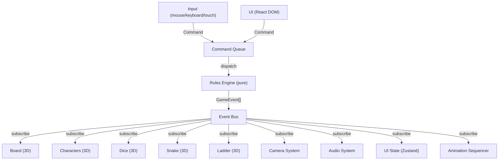
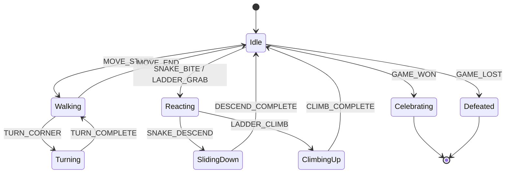
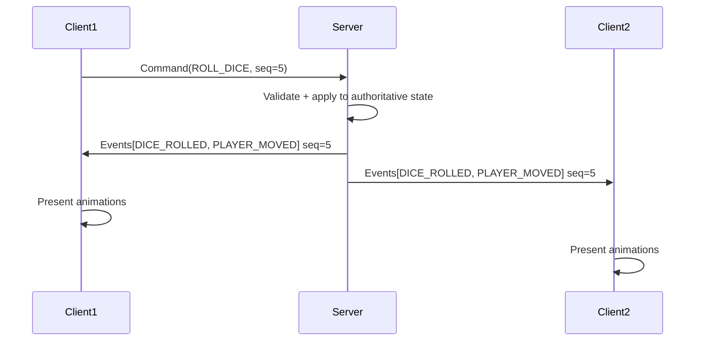

# System Architecture — 3D Snakes & Ladders

## 1. System Architecture & Module Communication

### Communication pattern: Typed Event Bus + Command Queue

The system uses a **synchronous typed event bus** for module communication. Game logic operates through a **command queue**: UI/input dispatches commands → rules engine processes them → emits domain events → presentation layer subscribes and reacts.



**Why event bus over direct imports?** Presentation modules (board, camera, audio) must never import each other or the rules engine. Events decouple them. The bus is synchronous (not async) because all subscribers execute in the same frame; no network latency in local play.

### Layer dependency rules

```
ui / input          (may import: presentation, state, rules, shared)
    ↓
presentation        (may import: state, shared)
    ↓
state               (may import: rules, shared)
    ↓
rules               (may import: shared)
    ↓
shared              (imports nothing from project)
```

- `rules` and `state` must NEVER import Three.js, React, DOM APIs, audio, or any presentation code.
- `presentation` reacts to domain events. It never changes game outcomes.
- Features within `presentation` communicate through the event bus, never by reaching into each other's internals.

---

## 2. Scene Architecture

### Scene graph layout

```
Scene (THREE.Scene)
├── BoardGroup          — tiles, numbers, board frame, decorations
│   ├── TileMesh[0..99] — individual tile meshes with userData.tileId
│   ├── TileLabels      — drei <Html> for tile numbers
│   └── BoardFrame      — border, bevels, base
├── EntityGroup         — dynamic game objects
│   ├── PlayerCharacter[0..3] — character meshes with skeletal animation
│   ├── DiceGroup       — dice mesh + physics replay visual
│   ├── SnakeGroup[0..n]     — procedural snake bodies
│   └── LadderGroup[0..n]    — ladder meshes
├── EnvironmentGroup    — arena, decorations, skybox
│   ├── Arena           — surrounding environment geometry
│   ├── Fog/Volumetrics — atmospheric effects
│   └── Decorations     — animated background elements
├── EffectsGroup        — particles, impact effects
├── LightingGroup       — all light sources
│   ├── AmbientLight
│   ├── DirectionalLight (main + shadow)
│   └── PointLights (accent, neon)
└── CameraRig           — managed by camera system
```

### Lifecycle & disposal

- Each group has a `dispose()` method that recursively disposes geometries, materials, and textures.
- Objects removed mid-game (e.g. particles) call `dispose()` immediately.
- Scene reset (new game) disposes all entity/effects groups and rebuilds.

---

## 3. Game-State Architecture

### State shape

```typescript
interface GameState {
  boardConfig: BoardConfig;        // snake/ladder map, size, rules
  players: PlayerState[];          // position, id, name, color
  currentPlayerIndex: number;
  turnPhase: TurnPhase;            // 'waiting' | 'rolling' | 'moving' | 'event' | 'finished'
  lastDiceResult: number | null;
  winner: number | null;           // player index or null
  turnNumber: number;
  rngState: number;                // seeded RNG internal state
  commandLog: GameCommand[];       // for replay
}

type TurnPhase = 'waiting' | 'rolling' | 'moving' | 'snake-event' | 'ladder-event' | 'finished';

interface PlayerState {
  id: string;
  name: string;
  position: number;                // tile number (1-100)
  color: string;
}

interface BoardConfig {
  size: number;                    // default 100
  snakes: Record<number, number>;  // head → tail
  ladders: Record<number, number>; // bottom → top
  rules: GameRules;
}

interface GameRules {
  exactFinish: boolean;            // must roll exact to land on final tile (default: true)
  extraTurnOnSix: boolean;         // roll 6 → roll again (default: false)
  maxPlayers: number;              // 2-4 (default: 4)
}
```

### Command → Event flow

```typescript
type GameCommand =
  | { type: 'ROLL_DICE'; playerId: string }
  | { type: 'RESTART_GAME' }
  | { type: 'SKIP_ANIMATION' };

type GameEvent =
  | { type: 'DICE_ROLLED'; playerId: string; value: number }
  | { type: 'PLAYER_MOVE_START'; playerId: string; from: number; to: number }
  | { type: 'PLAYER_MOVED_STEP'; playerId: string; tile: number }
  | { type: 'LANDED_ON_SNAKE'; playerId: string; from: number; to: number }
  | { type: 'LANDED_ON_LADDER'; playerId: string; from: number; to: number }
  | { type: 'TURN_ENDED'; nextPlayerId: string }
  | { type: 'GAME_WON'; playerId: string }
  | { type: 'OVERSHOOT'; playerId: string; attempted: number; stayAt: number };
```

### Seeded RNG

All randomness in `rules` uses a seeded PRNG (mulberry32 or similar). `rngState` is part of `GameState`. The same seed + same commands = identical game. `Math.random()` is forbidden in `rules/` and `state/`.

### Snake/ladder resolution as DATA

When a player lands on a snake head (e.g. tile 38), the rules engine instantly resolves the final position (e.g. tile 20) and emits `LANDED_ON_SNAKE { from: 38, to: 20 }`. The animation layer receives this event and choreographs the visual descent. The rules engine does NOT wait for animation.

---

## 4. Rendering Architecture

### Pipeline

1. Scene setup (lights, materials, post-processing)
2. Per-frame: update animations → update positions → render scene → post-processing

### Materials

- **Board**: MeshStandardMaterial with emissive edges (neon accents)
- **Characters**: MeshStandardMaterial with distinct player colors
- **Snakes**: MeshStandardMaterial with emissive + custom snake body shader (procedural scales)
- **Ladders**: MeshStandardMaterial with emissive rungs
- **Environment**: MeshStandardMaterial + fog

### Lighting

- 1 DirectionalLight (main, warm white, with shadow map)
- 1 AmbientLight (low intensity, cool)
- 2-4 PointLights (neon accent colors, no shadows)
- Emissive materials provide "glow" without additional lights

### Post-processing chain

1. Bloom (selective, intensity-controlled)
2. Tone mapping (ACES Filmic)
3. SMAA (anti-aliasing)
4. Vignette (subtle)

### Quality tiers

| Setting | High | Medium | Low |
|---|---|---|---|
| Shadow map | 2048 | 1024 | Off |
| Post-processing | Full chain | Bloom + tone map | Tone map only |
| Particle cap | 500 | 200 | 50 |
| Snake body segments | 32 | 16 | 8 |
| Environment detail | Full | Simplified | Minimal |
| Anti-aliasing | SMAA | FXAA | None |
| Pixel ratio | devicePixelRatio | min(dpr, 1.5) | 1.0 |

Gameplay is identical across all tiers. Only visual fidelity changes.

---

## 5. Animation Architecture

### Animation state machine (per character)



### Blending

- Crossfade duration: 150ms between states (no pops).
- Root motion policy: **no root motion**. Character position is driven by the movement system. AnimationMixer plays animations in-place.

### Cinematic sequencer

A data-driven sequencer plays multi-phase sequences (e.g. snake bite):

```typescript
interface CinematicSequence {
  id: string;
  phases: SequencePhase[];
  maxDuration: number;          // watchdog: force-complete after this
  canSkip: boolean;
  canShorten: boolean;          // after first view, play shortened version
}

interface SequencePhase {
  name: string;
  duration: number;
  onEnter: () => void;
  onUpdate: (progress: number) => void;
  onExit: () => void;
  camera?: CameraDirective;     // camera mode for this phase
  audio?: AudioDirective;       // sound triggers
}
```

**Completion guarantees**: Every sequence has a `forceComplete()` method that instantly sets all objects to their final state (positions, animations, visibility). The watchdog timer calls `forceComplete()` if `maxDuration` is exceeded. Skipping also calls `forceComplete()`.

---

## 6. Camera Architecture

### Camera modes

| Mode | Trigger | Behavior |
|---|---|---|
| **Gameplay** | Default | Elevated 3/4 view, follows active player with damping |
| **Dice** | DICE_ROLLED | Frame the dice and active player |
| **Movement** | PLAYER_MOVE_START | Follow player along path with predictive framing |
| **Snake** | LANDED_ON_SNAKE | Cinematic: show snake head → player → descent path |
| **Ladder** | LANDED_ON_LADDER | Cinematic: show ladder → player climbing |
| **Victory** | GAME_WON | Orbit around winner with celebration framing |
| **Overview** | User toggle | Bird's-eye view of entire board |

### Blending

- Smooth interpolation between modes using spherical lerp for position, quaternion slerp for rotation.
- Easing: ease-in-out cubic. Duration: 600ms default.
- Hysteresis: don't switch modes for events shorter than 200ms.

### Obstruction detection

- Raycast from camera to active character each frame.
- If occluded: push camera closer or orbit around obstruction.
- Min/max distance constraints (2–20 units from target).
- Recovery: if camera position contains NaN or is inside geometry, snap to last valid position.

### Safe-area awareness

Camera framing respects UI overlay areas (top HUD, bottom controls). The "useful" viewport is the area not covered by UI elements.

---

## 7. Snake & Ladder Interaction Architecture

### Snake architecture

- **Body**: Procedural mesh generated from a CatmullRom spline (head position → control points → tail position).
- **Idle animation**: Sinusoidal displacement along the spline (breathing/slithering).
- **Head tracking**: Head bone/group looks toward the active player when nearby.

### Snake bite cinematic phases

1. **Detect** (0.3s): Snake notices player landing on its head tile
2. **Tension** (0.5s): Snake coils, head draws back
3. **Prepare** (0.3s): Snake opens mouth, player shows fear
4. **Lunge** (0.2s): Snake strikes forward
5. **Contact** (0.2s): Player flinches
6. **Reaction** (0.3s): Player stumbles
7. **Descent** (variable): Player slides/falls along snake body to tail tile
8. **Recovery** (0.3s): Player lands, regains footing
9. **Resume** (0.2s): Return to idle

Total: ~2.3s + descent time. **Shortened mode**: phases 1-3 compressed to 0.3s total. **Skip**: instant teleport to final position.

### Ladder architecture

- **Model**: Parameterized mesh — two side rails + rungs spaced evenly for any length.
- **Climb path**: Parameterized curve from bottom tile center to top tile center, following the ladder geometry.
- **Climb animation**: Procedural hand/foot placement cycle. Speed adapts to ladder length (constant climb rate, not constant duration).

---

## 8. Asset Pipeline & Registry

### Asset registry interface

```typescript
interface AssetRegistry {
  getCharacterModel(id: string): Promise<CharacterAsset>;
  getBoardModel(id: string): Promise<BoardAsset>;
  getSnakeModel(id: string): Promise<SnakeAsset>;
  getLadderModel(id: string): Promise<LadderAsset>;
  getDiceModel(id: string): Promise<DiceAsset>;
  getEnvironmentModel(id: string): Promise<EnvironmentAsset>;
}

interface CharacterAsset {
  scene: THREE.Group;
  animations: Map<string, THREE.AnimationClip>;
  skeleton?: THREE.Skeleton;
  dispose: () => void;
}
```

### Loading & fallbacks

1. Attempt to load glTF from registry
2. On failure: instantiate procedural placeholder (Three.js primitives)
3. Log error with asset ID and module name
4. Gameplay continues — never blocks on a missing asset

### Compression (when real assets arrive)

- Geometry: Meshopt compression via gltf-transform
- Textures: KTX2 (UASTC for quality, ETC1S for size)
- Runtime: MeshoptDecoder + KTX2Loader registered on GLTFLoader

---

## 9. UI, Audio & Input Architecture

### UI architecture

- **Framework**: React DOM overlay (Next.js pages + components)
- **In-scene**: drei `<Html>` for world-space labels (tile numbers, player names)
- **State**: Zustand stores for UI state (menus, settings, HUD data)
- **Screens**: Main menu, player setup, game HUD, settings, pause, victory
- **Styling**: Tailwind CSS v4 with game-themed design tokens

### Audio architecture

```
AudioManager
├── MusicBus      (Howler) — BGM, state-based transitions
├── SFXBus        (Howler) — dice, footsteps, UI sounds
├── AmbienceBus   (Howler) — background atmosphere
└── SpatialBus    (Three.js PositionalAudio) — snake hiss, dice impact
```

- Volume controls per bus, persisted to localStorage.
- Mobile autoplay unlock via Howler's built-in handler.
- Audio sprites for related SFX (reduces HTTP requests).
- Tab visibility handling: pause/resume on blur/focus.

### Input architecture

```typescript
interface InputManager {
  onRollDice: () => void;
  onSkipAnimation: () => void;
  onPause: () => void;
  onCameraToggle: () => void;
}
```

- **Mouse**: Click to roll, click UI buttons
- **Keyboard**: Space = roll, Escape = pause, S = skip animation
- **Touch**: Tap to roll, swipe for camera, large touch targets (min 44px)
- **Gamepad**: A = roll, B = skip, Start = pause (future)
- **Guards**: Debounce to prevent double-roll, disabled during animations

---

## 10. Performance Strategy & Budgets

### Per-frame budgets

| Metric | High tier | Medium tier | Low tier |
|---|---|---|---|
| Target FPS | 60 | 60 | 30 |
| Frame time | 16ms | 16ms | 33ms |
| Draw calls | <100 | <60 | <30 |
| Triangles | <200K | <100K | <30K |
| Texture memory | <128 MB | <64 MB | <32 MB |

### Strategies

- **Instancing**: Tile meshes, ladder rungs, particle systems
- **Frustum culling**: Built-in Three.js (enabled by default)
- **LOD**: Environment objects only (board always full detail)
- **Object pooling**: Particles, temporary effects
- **No per-frame allocations**: Reuse Vector3/Matrix4/Quaternion in hot paths
- **Lazy loading**: Audio sprites, environment assets loaded after gameplay-critical assets

### Initial load budget

- Target: <3s on 4G connection
- Critical path: Three.js core + board data + 1 character placeholder
- Deferred: environment, audio, additional characters

---

## 11. Error-Prevention Design

### Watchdog timers

Every animation sequence and camera transition has a max-duration watchdog:
- Animation sequence: `maxDuration` field, force-complete on expiry
- Camera blend: 3s max, snap to target on expiry
- Dice physics replay: 5s max, snap to final orientation on expiry

### State validation

Every turn, validate:
- Player position is 1–100 (or board size)
- No two game states claim different current players
- Turn phase transitions are legal
- Command log replay produces identical state

### Transform guards

Before applying any transform, guard against:
- NaN in position/rotation/scale → snap to last valid
- Position outside board bounds → clamp to nearest tile
- Camera inside geometry → push to last valid position

### Recovery paths

- If animation deadlocks → watchdog force-completes, emit TURN_ENDED
- If state corrupts → log error, attempt rollback to last valid state from command log
- If asset fails → use placeholder, log warning, continue

---

## 12. Debug Tooling Design

Debug mode is enabled via URL param `?debug=1` or keyboard shortcut (Ctrl+D). Stripped from production builds via tree-shaking (all debug imports behind `if (process.env.NODE_ENV === 'development')`).

### Debug overlays

- **State inspector**: Current game state, turn phase, player positions
- **Tile overlay**: Tile IDs, snake/ladder connections
- **Camera debug**: Position, target, mode, frustum visualization
- **Animation debug**: Current state, blend weights, sequence progress
- **Performance**: FPS, draw calls, triangle count, memory
- **Event log**: Scrollable log of all domain events

---

## 13. Testing Strategy

### Unit tests (Vitest)

- Rules engine: every dice value, every tile, snake/ladder resolution, overshoot, win condition, turn rotation, invalid commands, replay determinism
- Seeded RNG: determinism verification
- State serialization: round-trip integrity

### Integration tests (Vitest)

- Command → event flow end-to-end (headless, no rendering)
- Fuzz test: thousands of random games, assert no invalid state

### E2E tests (Playwright — Phase 10)

- Full game playthrough on desktop and mobile viewports
- UI interaction (roll, skip, pause, restart)
- Visual regression screenshots

### CI pipeline

- Lint (ESLint) → Type check (tsc) → Unit tests (Vitest) → Build (next build)

---

## 14. Future Online Multiplayer Architecture

### Model: Authoritative server + command sync



### Key design constraints (already enforced in local play)

- Rules engine is pure: `(state, command) → (state, events)` — no side effects
- All state is serializable (JSON)
- Seeded RNG means server controls randomness
- Command log enables replay and reconnection
- Presentation layer is event-driven, never blocks game logic

### Anti-cheat

- Server-side RNG (client never sees seed)
- Server validates all commands (can't roll when it's not your turn)
- State hash comparison for desync detection

### Latency handling

- Client shows optimistic UI ("rolling...") while waiting for server response
- Animations begin only after server-confirmed events arrive
- Late-joining client fast-forwards through command log (headless replay → present final state)

---

## 15. Final Project Structure

```
/src
  /core               — game bootstrap, event bus, game loop, config
    eventBus.ts        — typed pub/sub event bus
    gameLoop.ts        — main update loop coordinator
    config.ts          — global game configuration
    index.ts           — public entry
  /rules              — pure deterministic game logic
    gameReducer.ts     — (state, command) → (state, events)
    boardDefinition.ts — board layout, snake/ladder map, validation
    seededRng.ts       — deterministic PRNG
    turnStateMachine.ts — turn phase transitions
    index.ts
  /state              — game state management, commands, events
    gameState.ts       — state types and initial state factory
    commandTypes.ts    — command type definitions
    eventTypes.ts      — event type definitions
    serialization.ts   — serialize/deserialize game state
    index.ts
  /shared             — math, types, utilities (no project imports)
    mathUtils.ts       — lerp, clamp, easing functions
    types.ts           — shared type definitions
    index.ts
/docs
  PHASES.md            — spec (never edit)
  RESEARCH.md          — Phase 0 research
  DECISIONS.md         — Architecture Decision Records
  PROGRESS.md          — work log
  ARCHITECTURE.md      — this file
/tests                 — cross-module integration tests (future)
```

Presentation-layer folders (`/src/board`, `/src/dice`, `/src/characters`, `/src/snake`, `/src/ladder`, `/src/animation`, `/src/camera`, `/src/environment`, `/src/effects`, `/src/audio`, `/src/ui`, `/src/input`, `/src/rendering`, `/src/assets`, `/src/debug`) are created only when they contain real code (Phase 3+).
